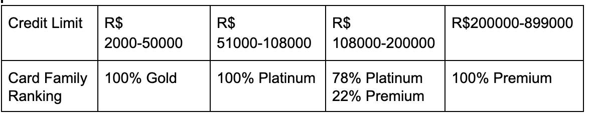
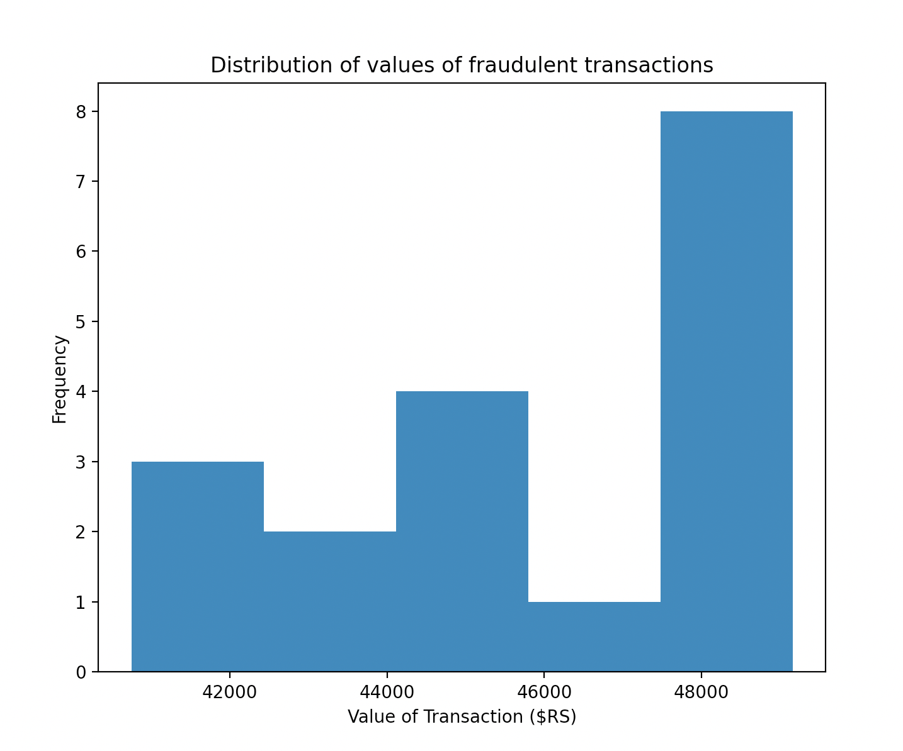
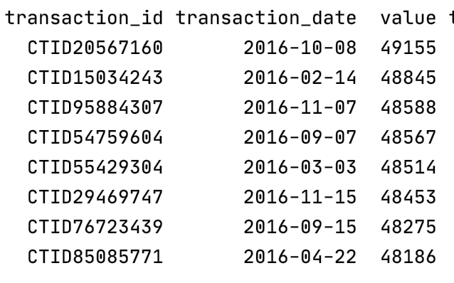
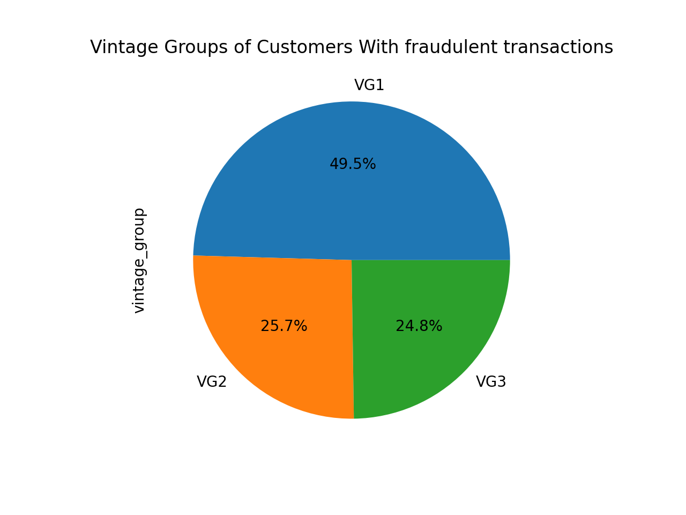
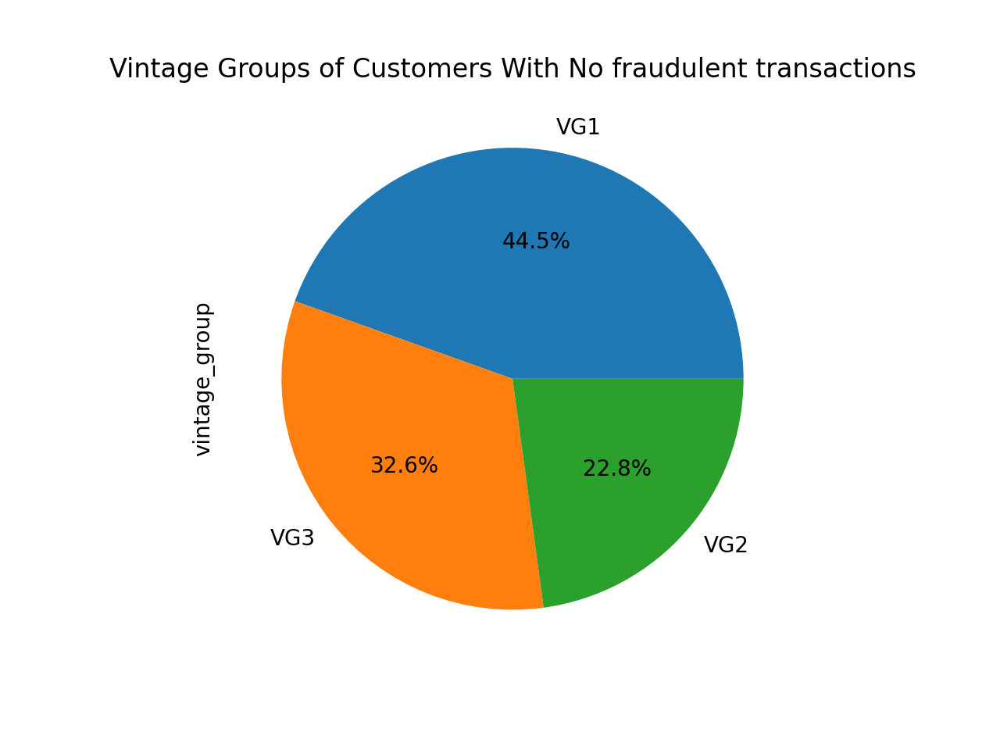
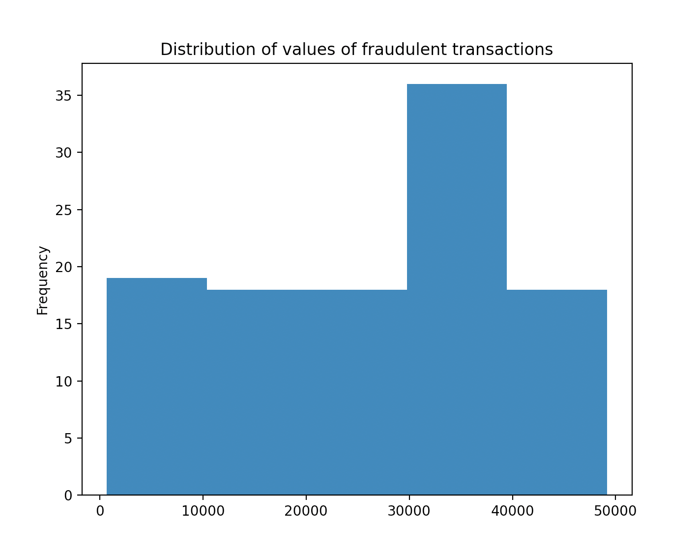
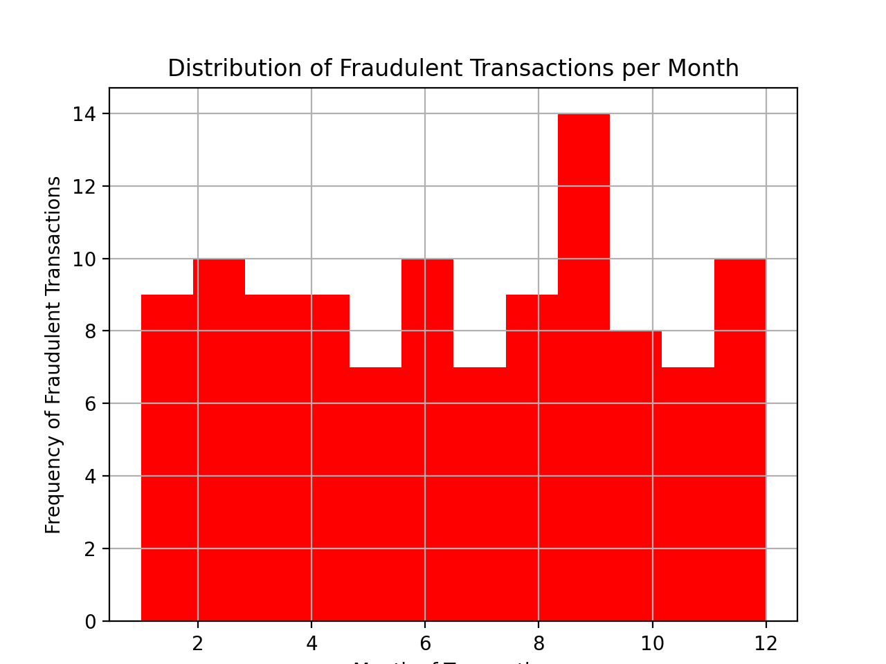

### Banking Data Challenge
----
This repository contains my answers to the Stone data challenge

## Technologies used
  Language: Python <br />
  Python Libraries: 
 		psycopg2 - Used to establish a connection with the PostgreSQL database
    pandas - Used to extract and analyze data from the database
		matplotlib - Used to plot graphs and diagrams 

## Instructions to run
   You must install Python3 with psycopg2, pandas and matplotlib prior to attempting to run
   Run python -m solver.main.py 
   Will be printed in console answers for part 1 (in data frames and text)
   To plot graphs, must run functions individually.

## Project Structure
  Solver - Package folder <br /> 
    |_ consts.py *Names of tables<br />
    |_ data_extraction.py *Functions finding extracting data for part 1<br />
    |_ db_connection.py *Functions establishing and closing connection to PostgreSQL database<br />
    |_ utils.py *Functions implementing functionalities such as merging and sorting tables, getting column names for tables and more<br />
    |_ fraud_analytics.py *Functions performing analysis for part 2<br />
    |_ fraud_graphing.py *Functions plotting graphs for part 2<br />

## Answers
----
Part 1 : Data Extraction & Analytics 
----

### What is the average age of the customers in the database <br />

**Answer** :  <br />The average age of customers in the database is 35 years old <br />

**File Location**: solver/data_extraction.py | **Function name**: get_age_average

### How is the card_family ranked based on the credit_limit given to each card? <br />

**Answer** : <br /> The three tiers of card family are Gold, Platinum and Premium in increasing order of credit limit. The cards with the lowest limits, between **R$ 2000-50000**, are ranked as **Gold**. The cards with the highest credit limits, between **R$200000-899000**,  are ranked as **Premium**. The cards with a credit limit between **R$51000-108000** are ranked as **Platinum**, although these constitute **only 31% of the Platinum cards.** The cards with a credit limit between **R$108000-200000** can either be ranked as **Premium or Platinum**. It is relevant to note that **78%** of the cards within this interval are ranked as **Platinum**, and 69% of the Platinum cards are in this interval. Moreover, within this range of credit limit (R$108000-200000) , there is no indication that the choice of ranking between Platinum and Premium depends on their proximity to the higher or lower ends of the interval.**Based on that, it is safe to assume that there exists other variables that influence the ranking of a card as Premium within this interval**. It seems most likely that there are extraneous variables influencing the classification within this interval. This could be the case if, for example, customers with a credit limit above R$108000 were given the option to pay the additional fee to get Premium benefits, and naturally those with higher credit limit (above R$200000) are more likely to pay.

**Summarizing Table** <br /> 


**File Location**: solver/data_extraction.py | **Function name**: cfamily_creditlimit_correlate

### For the transactions flagged as fraud, what are the ids of the transactions with the highest value? <br />

**Note** <br /> 
 

**Answer** <br /> 
The fraudulent transaction with the highest value (of R$49155.00) has id is ```CTID20567160```

In order to have a better understanding of the distribution of the highest values, I plotted a histogram showing the distribution of values above R$40000.00. As can be seen in the image below, the last bucket contains 8 transactions (out of 107 total fraudulent transactions), it contains all transactions above the 93rd Percentile of the overall distribution. If looking for the highest set of values, I would therefore consider everything in the top 7% of the interval. 




Table with the id's of the 8 transactions with highest value



**File Location**: solver/data_extraction.py | **Function name**:  highest_value_frauds

----
Part 2 : Data Analytics 
----
### Analyze whether or not the fraudulent transactions are somehow associated to the other features of the dataset. Explain your results <br />

In order to answer this question, I split my analysis into two subsections: **1.investigating if characteristics of certain card holders (customers) make them prone to fraudulent transactions**, and **2.investigating if characteristics of the transactions themselves might indicate fraud**. I will present here all relevant findings, indicating factors in the database which might be associated with fraud. <br />

**Vintage Groups and Fraud**
Assuming that vintage group refers to the 'age (vintage)' of a card holders customer status, a correlation between fraud and a particular vintage group of customer could be insightful. 

I plotted two pie charts, with the distribution of the vintage groups of card holders who did suffer fraud and those which didn't. 

 

As can be seen in the pie charts, vintage group 1 is the most common accross all card holders. Amongst card holders that suffered from fraud, that predominance is even stronger, 49.5% of frauds happened to customers in VG1, making it the most vulnerable. Moreover, whereas vintage group 3 makes up 32.6% of customers that did not suffer fraud, it only makes up 24.8% of customers that did suffer fraud. This diference of 7.8% is relevant enough to indicate that customers of vintage group 3 have a lower likelihood of suffering fraud. 

**File Location**: solver/fraud_graphing.py | **Function name**: vintage_group_fraud, vintage_group_non_fraud

Regarding customer data, no relevant trend was identified relating the age or card family of card holder to their vulnerability to fraud. Vintage group could be somehow associated to fraud, Vintage Group 1 seems more vulnerable and Vintage Group 3 less vulnerable. Nontheless, more data would be needed for a conclusion. 

**Fraudulent Transaction Values**
In this step, I analyzed the differences between the mean, maximum, minimum and distribution of values in fraudulent and non fraudulent transactions. 

The minimum value amongst non fraudulent transactions in the database is R$103, whereas the minimum value amongst fraudulent transactions is R$603. This is a significant difference, and suggests a correlation between transaction value and fraud. It could also be the case that fraudulent transactions below this value do not get reported/identified as easily. The average value of fraudulent transactions in the database is also higher than that for non fraudulent transactions. Non fraudulent transaction have an average value of R$24736.148519, whereas fraudulent transactions have an average value of R$26808.880734, which means that the average value for fraudulent transactions is 8.4% higher. 

**File Location**: solver/fraud_analytics.py | **Function name**: value_transactions_describe

The distribution of values of fraudulent transactions provides further insights, as seen in the image below. 



In specific, it is aparent that a large percentage(32%) of fraudulent transactions have values between R$30000-40000. 

With this information, we can assume the values of transactions are associated to them being fraudulent or not. Specifically, because frauds tend to occur for values above the benchmark of R$630, are in average higher, and most likely for transactions between R$30000-40000.

**Value and transaction segment**
In this step, rather than investigating how a single variable in the database might relate to fraudulent transactions, I investigated the two factors of transaction segment and value. 

I started by investigating which transaction segments have the most fraudulent transactions. I found that to be Segment 11 (SEG11), 13% of frauds happen within this segment. **File Location**: solver/fraud_analytics.py | **Function name**: describe_value_segment_transaction


**Fraudulent Transaction Month**
In this step, I analyzed the distribution of fraudulent transactions per month (as the database only contains values for the year of 2016). 

**File Location**: solver/fraud_graphing.py | **Function name**: fraud_month_distribution



As seen in the histogram, the 9th month (September) has the highest number of frauds. In fact, 13% of frauds within the database happened in September. This indicates that fraudulent transactions might be related to months of the year.

## Clarification points 
- For the analysis pertaining to characteristics of the customer, the command ```drop_duplicates(["customer_id"], keep="first")``` was 	used to avoid averages and data distributions to be skewed towards the data for customers that perform multiple transactions. <br />
- This analysis is restricted to the information available in the database. I recognize that, for example, for card family ranking analysis, it is possible that having more data points would lead to different conclusions about the limits of each ranking.

	
